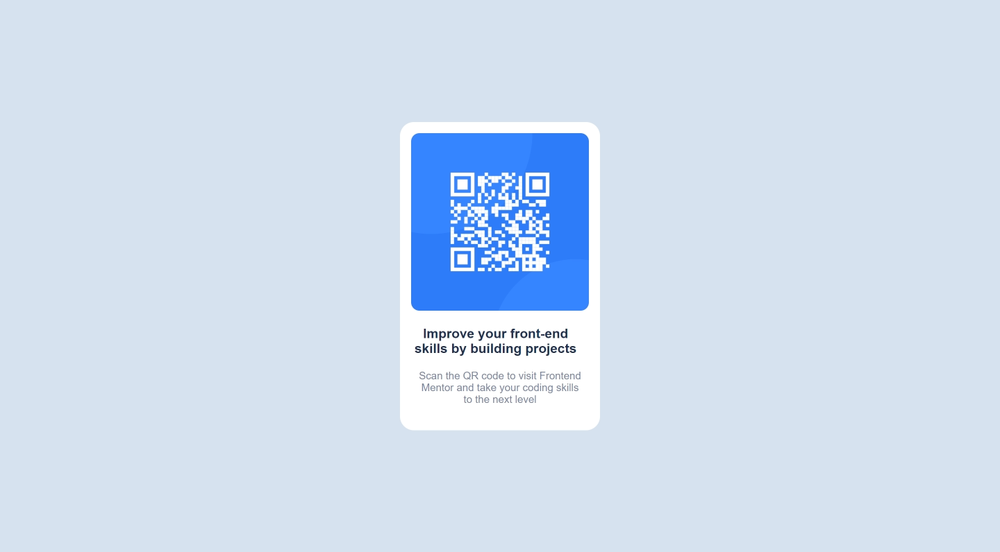

## Table of contents

- [Overview](#overview)
  - [Screenshot](#screenshot)
  - [Links](#links)
- [My process](#my-process)
  - [Built with](#built-with)
  - [What I learned](#what-i-learned)
  - [Continued development](#continued-development)
  - [Useful resources](#useful-resources)
- [Author](#author)

## Overview

### Screenshot

### Links

- Solution URL: [Github](https://github.com/Halleys123/QR-code-component-FrontEndMentor)
- Live URL: [Netlify](https://main--jade-malasada-619b97.netlify.app)

## My process

The project was developed only with HTML and CSS. The page's structure was created with html, then the desktop version's styling was added with CSS, and finally the mobile version's styling was applied, which consisted of resizing the entire container to match the mobile screen.

### Built with

- Semantic HTML5 markup
- CSS custom properties
- Flexbox
- Desktop-first workflow

### What I learned

I learnt about the use of 'flex-wrap' property of flexbox and its affect on other flex properties like align-content. I also got to know about the difference in align-content, align-items, justify-content and justify-items.

### Continued development

- flex-box along with its properties

### Useful resources

- [MDN](https://developer.mozilla.org/en-US/docs/Web/CSS/flex-wrap) - This helped me with flex-wrap property.

## Author

<!-- - Website - [Arnav Chhabra](https://www.your-site.com) -->

- Frontend Mentor - [@Halleys123](https://www.frontendmentor.io/profile/yourusername)
- Twitter - [@Halleys123](https://twitter.com/ArnavChhabra3)
